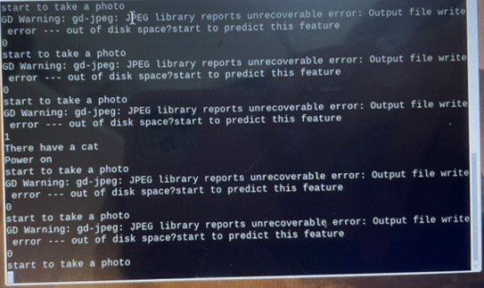
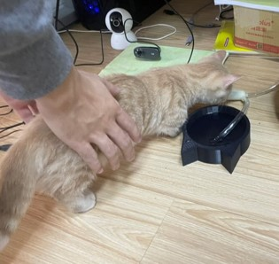

# VGG demo
樹莓派程式/main_1.py : Take a picture to determine if there is a cat and send a signal to another Raspberry pi.  
樹莓派程式/main_2.py : Receive the signal from another Raspberry Pi and start the micro pumping motor.  
VGG.ipynb : Training the VGG model.  
  
Below is sample:  

